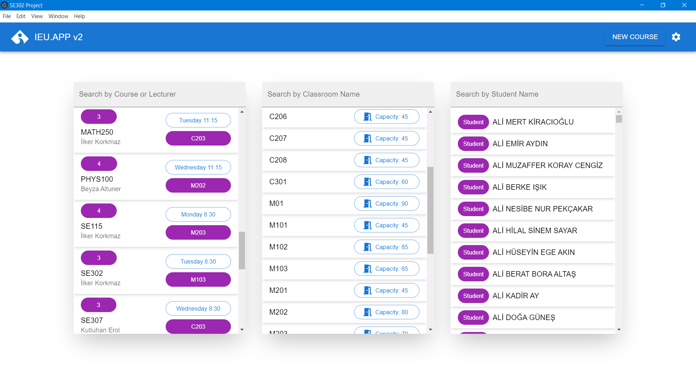

# IEU.APP v2 


The project is a standalone desktop application that can handle course scheduling and maintaining process. It enables the user to manage classrooms, handle course schedules, inspect weekly schedules, and make further modifications easily

## Features
- **Import files:** The system supports data import via an import button, allowing users to upload Courses.csv and ClassroomCapacity.csv files. The imported files are processed, and their content is stored in IndexedDB.

- **Classroom Assignment and Course Distribution:** Using the distribute button, users can create class schedules from the imported files without conflicts.

- **Add New Courses:** It allows users to add events, such as new courses or project meetings, by searching for and selecting students and entering information through the new course page.

- **Change Course Classrooms:** Enables users to change the classrooms of courses without issues related to classroom capacities directly from the course page.

- **View Weekly Schedules:** Users can view predefined weekly schedules for any class, subject or student by clicking on any of them.

- **Edit Student Courses:** By clicking on any student, the user can either remove courses assigned to that student or add a new course.

- **Easy transition between pages:** Users can navigate between pages and view details by clicking on any student, class, or course information displayed.





## Getting Started

This project provides a template to get started with React, TypeScript, Vite, and Electron. It includes HMR (Hot Module Replacement) and some ESLint rules for a minimal setup.

### Prerequisites

- Node.js (>= 14.x)
- npm or yarn

### Installation

Clone the repository and install dependencies:

```sh
git clone <repository-url>
cd <repository-directory>
npm install
```

### Starting the Development Server

To start the development server:

```sh
npm run dev
```

### Starting the Electron Application

To start the Electron application:

```sh
npm run electron:dev
```

### Building for Production

To build the project for production:

```sh
npm run build
```

### Packaging the Electron Application

To package the Electron application:

```sh
npm run electron:build
```

## Technologies Used

- [React](https://reactjs.org/)
- [TypeScript](https://www.typescriptlang.org/)
- [Vite](https://vitejs.dev/)
- [Electron](https://www.electronjs.org/)

## Documents
[Link to the Requirements Document(PDF)](src/docs/SE302RequirementsDocumentTeamNo2.pdf)

[Link to the Software Design Document(PDF)](src/docs/SE302DesignDocumentTeamNo2.pdf)


