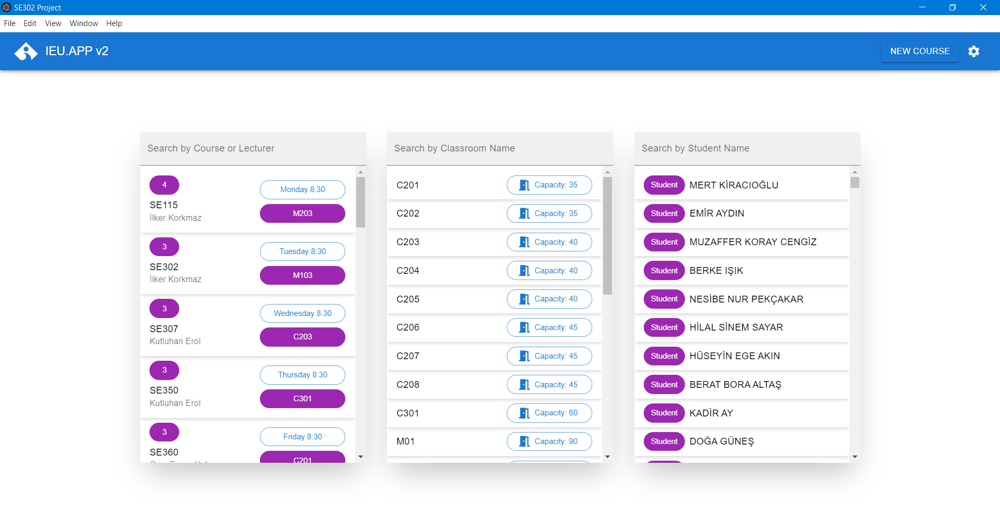

# IEU.APP v2 


This project provides a comprehensive solution for educational institutions to manage their course scheduling process.It enables the user to manage classrooms, handle course schedules, inspect weekly schedules, and make further modifications easily.



## Features

### Course Management
- View all courses and their details
- Add new courses with:
  - Course code
  - Instructor name 
  - Time slot
  - Duration in lecture hours
  - Student list
- Assign/reassign classrooms to courses
- View course schedules in a weekly timetable


&nbsp;


### Classroom Management
- View classroom capacities and schedules
- Automatic classroom distribution based on:
  - Room capacity vs student count
  - Schedule conflicts
  - Time availability
- View classroom usage in weekly timetable


&nbsp;


### Student Management  
- View student schedules and enrollments
- Add/remove students from courses
- Check course conflicts for students
- View total course hours per student


&nbsp;

## Usage Examples

### Adding a New Course

1. Click the "New Course" button in the top bar
2. Fill in the course details:
    ```typescript
    {
      Course Code: "SE302",
      Instructor: "İlker Korkmaz",
      Students: ["Student1", "Student2"],
      TimeToStart: "Monday 08:30", 
      DurationInLectureHours: "3",
      Classroom: "C201"
    }
    ```


### Importing Data 

The system requires two CSV files for initialization:
1. Click "Import" in the settings menu
2. Select either:
   - `ClassroomCapacity.csv` for classroom data
   - `Courses.csv` for course data 

CSV Format for Courses:
```csv
Course;TimeToStart;DurationInLectureHours;Lecturer;Students
SE101;Monday 08:30;3;İlker Korkmaz;Student1;Student2
```

CSV Format for Classrooms:
```csv
Classroom;Capacity  
C201;35
```


### Auto-Distributing Classrooms

1. Click "Distribute" in the settings menu
2. System will automatically:
   - Check classroom capacities
   - Verify schedule conflicts
   - Assign optimal classrooms

## Getting Started
This project provides a template to get started with React, TypeScript, Vite, and Electron. It includes HMR (Hot Module Replacement) and some ESLint rules for a minimal setup.

Ensure you have Node.js (>= 14.x) and either npm or yarn installed.

1. Install dependencies:
    ```bash
    npm install
    ```

2. Run in development:
    ```bash
    npm run dev
    ```

3. Build for production:
    ```bash
    npm run build
    ```


## Technologies 

- [React](https://reactjs.org/)
- [TypeScript](https://www.typescriptlang.org/)
- [Vite](https://vitejs.dev/)
- [Electron](https://www.electronjs.org/)
- [Material-UI](https://mui.com/material-ui/)
- [Redux Toolkit](https://redux-toolkit.js.org/)
- IndexedDB


## Documents
[Link to the Requirements Document(PDF)](src/docs/SE302RequirementsDocumentTeamNo2.pdf)

[Link to the Software Design Document(PDF)](src/docs/SE302DesignDocumentTeamNo2.pdf)


